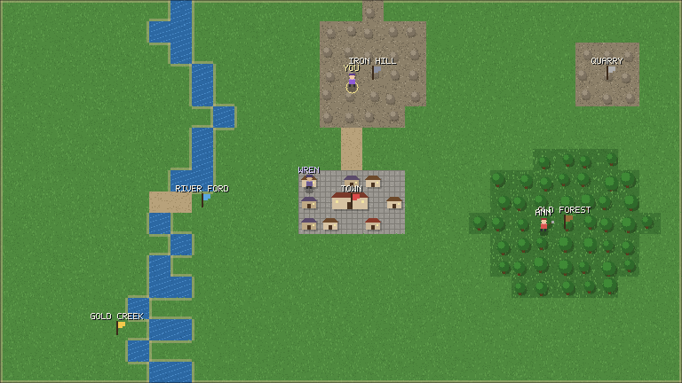

# project cqs

A persistent shared world where every character is piloted by words — and built by
them. You type what you want your character to do; a model turns that into a plan of
legal moves; the world applies it and keeps ticking in real time. Chain steps, name
the chain, run it forever. Found a place that yields anything you can name. Bring a
character into being with a persona and talk to them. A text adventure with a display
instead of a paragraph, and with other people in it. Destined for **cqs.gg**.



All Rust. The core crates have zero dependencies and compile for native and
`wasm32-unknown-unknown`. The design, the lineage it comes from, the decisions and
the milestones are in [docs/DESIGN.md](docs/DESIGN.md).

## Run it

```sh
cp .env.example .env        # put your Gemini key in GEMINI_API_KEY
cargo run -p cqs            # play at the terminal; the world ticks once a second
cargo run -p cqs -- --offline                                          # no model: keyword pilot
cargo run -p cqs -- --script "walk to the forest, chop 10 wood, then bank it" "save this as woodrun"
```

```text
> walk to the forest, chop 10 wood, then bank it
  pilot: go to Old Forest → gather 10 wood → bank  [702 ms, 1493 tokens]
Wanderer sets out for Old Forest.
> save this as woodrun
  pilot: save recipe woodrun
Wanderer saves recipe 'woodrun': go to Old Forest, gather 10 wood, bank.
> keep doing my woodrun forever
  pilot: run woodrun forever
> I found a damp hollow here full of mushrooms
  pilot: found Damp Hollow
Wanderer founds Damp Hollow. It yields mushrooms.
> an old forager named Wren lives here and talks to birds
  pilot: create Wren
Wren is here now, beside Wanderer.
> wren, what do the birds say about the mine?
  pilot: say "Wren, what do the birds say about the mine?"
Wren says "They say the iron sings at dusk, and that a pick answers it."
```

At the prompt, `/look` redraws and `/quit` leaves; everything else is said to your
character.

Say "make me a wizard's tower" and the world marks out a site with a bill of materials; gather
the stone, carry it there, and **build**, and a spire rises behind a scaffold. Say "whenever I have 20 wood, bank it" and the pilot writes a **Lua script** for your
character that runs whenever it is idle, in a sandboxed, fuel-metered pure-Rust VM
(piccolo). Agents can play over the API with no model at all: `GET /api/world?doc`.

## Layout

```
crates/
  gemini/   the Gemini API from first principles — zero deps in the core
    src/json.rs    a Value, a parser, a writer
    src/sse.rs     an incremental server-sent-events decoder
    src/lib.rs     Content/Part (signatures preserved), Request → HTTP, Response, stream folding, errors
    src/native.rs  --features native: ureq client (generate, stream, models, .env)
    src/web.rs     --features web:    fetch client for wasm32
    examples/chat.rs
  world/    the simulation: map, places, NPCs, characters, tasks, plans, recipes, skills, scripts
  script/   Lua on piccolo: a character's standing script, sandboxed and fuel-metered
    src/lib.rs     Command · plan/apply · step · describe (the text view) · ascii (the display)
    src/pilot.rs   system prompt, tool declarations, calls → Commands, the NPC voice, keyword fallback
  host/     serves a realm behind a Ledger (memory for tests, Neon over HTTPS for Vercel)
  web/      the browser client: draw.rs is the framebuffer renderer (tiles, figures, bitmap font)
  cqs/      the terminal game, with the clock on its own thread
api/world.rs  the Vercel function
docs/DESIGN.md
```

## Deploy

**Live: https://cqs.gg** (also https://cqs-rosy.vercel.app; Vercel project `cqs`, deployed from this repo on push).

The game runs on Vercel as one Rust function plus a static wasm page, with the world
in a Neon Postgres ledger (see the deployment section of `docs/DESIGN.md`).

```sh
wasm-pack build crates/web --target web --release --out-dir ../../public/pkg --no-typescript
vercel deploy            # preview
vercel deploy --prod     # production
```

The function reads `GEMINI_API_KEY`, `GEMINI_MODEL` and `DATABASE_URL` from the
project environment; `vercel env pull` brings them to `.env.local` for local use.
`api/world.rs` only compiles on Linux (the runtime crate), so locally it is a stub and
the deploy is the check.

## Test

```sh
cargo test                                                   # unit tests, no network
cargo check -p gemini --features web --target wasm32-unknown-unknown
cargo run -p gemini --features native --example chat -- --models
```

## The gemini crate on its own

```rust
use gemini::{native::Client, Function, Level, Request, Thinking, ToolMode, obj};

let client = Client::from_env()?;                       // GEMINI_API_KEY, .env aware
let req = Request::new("gemini-3.8-flash")
    .system("Answer by calling a tool.")
    .user("go north")
    .tool(Function::new("move_to", "Walk somewhere")
        .params(obj!{"type" => "object", "properties" => obj!{"target" => obj!{"type" => "string"}}}))
    .tool_mode(ToolMode::Any)
    .thinking(Thinking::Level(Level::Low));
let reply = client.generate(&req)?;
for call in reply.calls() {
    println!("{} {}", call.name, call.args);
}
// reply.content replays into the next request with its thought signatures intact.
```

Streaming is `client.stream(&req, |delta| ...)` and returns the same `Response` a
non-streaming call would. Structured output is `.json(schema)` then `reply.json()`.
Thinking is explicit: `Thinking::Level(..)` on 3.x models, `Thinking::Budget(n)` on
2.5 — nothing is sent unless asked, because the families reject each other's knob.
